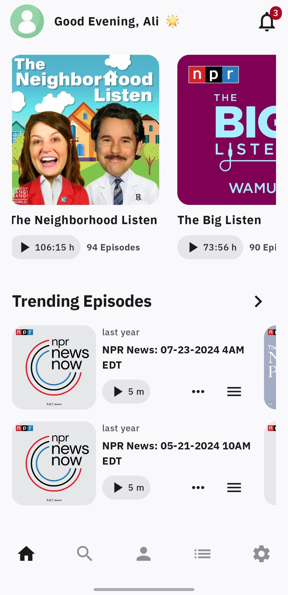
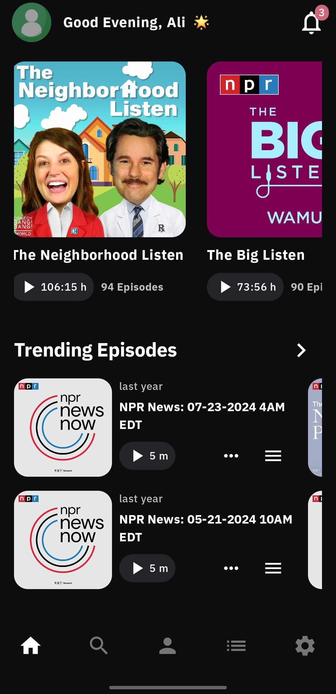

# 🎧 Podcast App

An Android application built with **Kotlin** and **Jetpack Compose**, showcasing a dynamic home screen with multiple content sections (Podcasts, Episodes, Audiobooks, Audio Articles) and a powerful search experience.  
The app focuses on **clean architecture, modern Android practices, and smooth UX**.

## 📦 Download APK

A ready-to-install debug APK is available from the **GitHub Releases** section:

👉 **Download APK:**  
https://github.com/ma7moud3ly/PodcastApp/releases/latest

---

## ✨ Features

- Dynamic **Home Screen** with multiple content sections
- Dedicated **Search Screen** with debounced API calls
- **Pagination** using Paging 3 (stable with nested scrolling)
- **Pull to Refresh** for updating home content
- **Nested Scrolling UI** with LazyRow & LazyGrid
- **Light & Dark Mode**
- **Arabic & English** localization
- Modular, clean, and testable architecture

---

## 🏗 Architecture

The app follows **MVVM + Clean Architecture (simplified)** principles:

```
App

├── MainActivity.kt
├── PodcastApp.kt

shared logic
├── core/
│   ├── data/mapper/
│   ├── di/
│   ├── domain/model/
│   └── ui/
│       ├── theme/
│       └── components/

Home Feature                          Search Feature
  data/                                 data/
  ├── api/                             ├── api/
  ├── datasource/remote/               ├── datasource/remote/
  ├── di/                              ├── di/
  ├── mapper/                          ├── mapper/
  ├── model/                           ├── model/
  └── repository/                      └── repository/

  domain/                               domain/
  ├── repository/                      ├── repository/
  └── use_case/                        └── use_case/

  presentation/                         presentation/
  ├── components/                      ├── components/
  ├── model/                           ├── model/
  ├── HomeScreen.k                     ├── SearchScreen.kt
  └── HomeViewModel.kt                 └── SearchViewModel.kt

```

### Key Architecture Decisions
- **MVVM** to separate UI from business logic
- **StateFlow & Coroutines** for reactive UI updates
- **Repository pattern** to abstract data sources
- **Single Activity / Single Module** for simplicity
- Clear **separation of concerns** between layers

---

## 🛠 Tech Stack

- **Language:** Kotlin  
- **UI:** Jetpack Compose  
- **Architecture:** MVVM  
- **Dependency Injection:** Dagger  
- **Networking:** Retrofit + OkHttp  
- **Async:** Kotlin Coroutines & Flow  
- **Image Loading:** Coil  
- **Navigation:** Navigation 3  
- **Pagination:** Paging 3  

---

## 🌐 API Endpoints

- **Home Sections:**  
  https://api-v2-b2sit6oh3a-uc.a.run.app/home_sections

- **Search:**  
  https://mock.apidog.com/m1/735111-711675-default/search


---

## 🎥 Demo Videos

| Light (EN)          | Dark (AR)                   |
|---------------------|-----------------------------|
| <video src="https://github.com/user-attachments/assets/1fbe75fc-cd29-44e1-9896-4498f8e909be" width="250" controls></video>  | <video src="https://github.com/user-attachments/assets/ff6f569e-a31b-417c-a312-eb418484ad8a" width="250" controls></video>  |

---

## 🖼 Screenshots

| Light (EN)                               | Dark (EN) |
|------------------------------------------|-----------|
|  |  |

| Light (AR)                               | Dark (AR) |
|------------------------------------------|-----------|
|  |  |

---

## ⚠ Challenges Faced

- Complex API structure with multiple section and content types
- Inconsistent API response formats
- Implementing stable pagination with nested scrolling
- Ensuring smooth UI performance across different section layouts

---

## 🚀 Future Improvements

- Offline support using Room Database
- More UI & integration tests

---

## 📚 Inspiration & References

- https://github.com/hadyhefny/ThmanyahPodcast  
- https://github.com/ohefny/Venues  
- https://github.com/hadyhefny/RickAndMorty  
